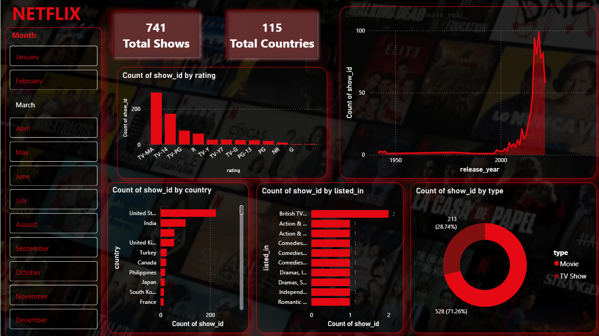

# Netflix Shows & Movies Power BI Dashboard

## 📊 Project Overview
This project features an interactive Power BI dashboard designed to analyze Netflix's content dataset. It provides key insights into content distribution, age ratings, genre classifications, top-producing countries, and content release trends over time.

---

## 🖼️ Dashboard Preview

---

## 💡 Key Features & Insights
- **Interactive Monthly Filtering:** Features a Month Slicer on the left panel that dynamically updates all KPIs and charts based on the selected month.
- **Key Summary Metrics:** High-level summary displaying Total Shows (741) and Total Countries (115).
- **Rating Breakdown:** Categorization of content by maturity ratings (e.g., TV-MA, TV-14, TV-PG).
- **Geographic Analysis:** Visual analysis of top content-producing nations (led by US, India, UK, etc.).
- **Genre & Category Analysis:** Classification of titles across various genres and categories.
- **Release Year Trends:** Line chart visualizing the rapid growth of Netflix content additions over recent decades.
- **Content Type Ratio:** Donut chart breakdown showing the proportion of Movies vs. TV Shows.

---

## 🛠️ Tools & Technologies
- **Business Intelligence:** Microsoft Power BI Desktop
- **Data Source:** Netflix Movies and TV Shows Dataset
- **Visuals Used:** Card Visuals, Column & Bar Charts, Donut Chart, Line Chart, and Slicers.

---

## 📁 How to Access & Interact
1. **Quick Preview:** Check the dashboard screenshot above.
2. **Interactive Experience:** Download the `n.pbix` file from this repository and open it in **Power BI Desktop** to use the monthly filters and explore the interactive visuals.
